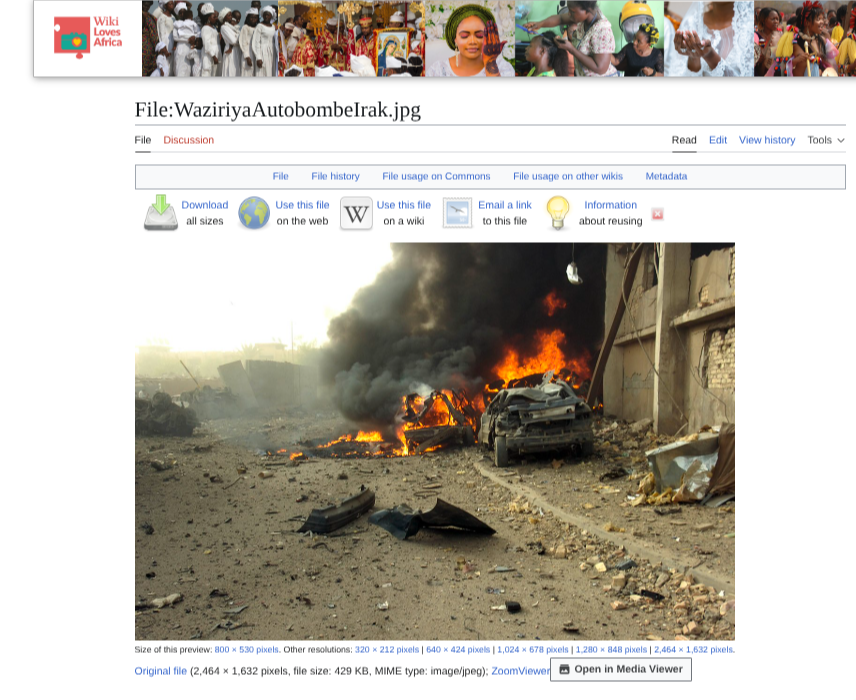
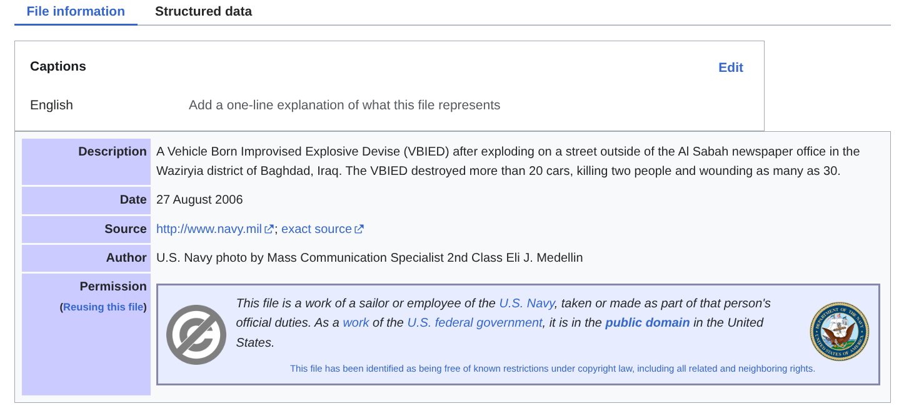

# Title: OSINT Exercise #006 - The photo is not of the event described by the journalist.

## Source: https://gralhix.com/list-of-osint-exercises

**Objective:**

* a) Verify the statement above.

# 1. Initial Observation

**Visual landmarks:** 
* A burning car
* Fire
* Destroyed building

**Initial Hypothesis:** 

Im guessing a struggling country thats been or is in war

# 2. The Investigation

* Step 1:
  * Google Lens: Reverse search the picture. Found a wikipedia page with the full photo. https://commons.wikimedia.org/wiki/File:WaziriyaAutobombeIrak.jpg

* Step 2: 
  * Verify authenticity: The date published is from 2006, which is the oldest evidence I could find, it is also from the navy

# 3. The Solution

* A) The photo is infact not what the journalist claimed, the actual events were a Vehicle Born Improvised Explosive Devise (VBIED) exploding infront of a newspaper office in the Waziryia district of Baghdad, Iraq, taken by a US navy named Eli J. Medellin

# 4. Tools Utilized

* Search Engines: Google (Searching), Google Lens (Reverse searching)
* Environment: Arch linux / Brave
